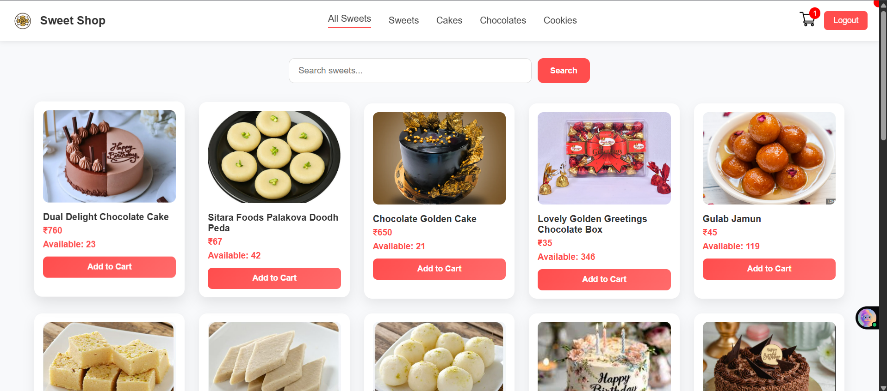
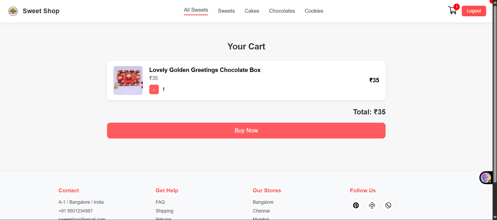
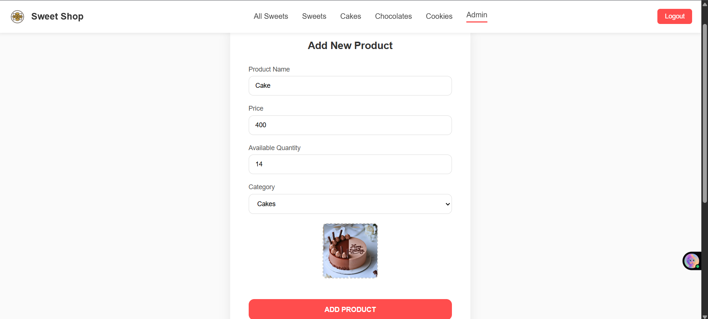
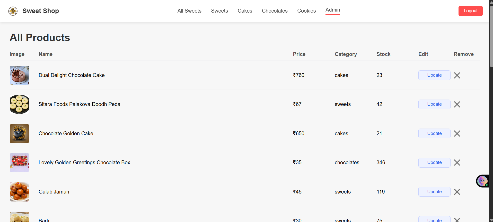

# 🍬 Sweet Shop Management System


🔗 **Live Demo**: https://incubyte-assessment-tpjy.vercel.app/  
📦 **GitHub Repository**: https://github.com/kundankumar95/incubyte-assessment

---

## 📌 Project Overview

The **Sweet Shop Management System** is a full-stack web application built as part of the **Incubyte TDD Kata Assessment**.

The application allows normal users to browse sweets, add them to a cart, and purchase items, while providing a **secure admin panel** for managing sweets such as adding, updating, and deleting products.

The project follows modern development practices, role-based access control, and clean architecture principles.

---

## 🎯 Objectives

- Build a RESTful backend API  
- Implement authentication & authorization  
- Provide admin-only inventory management  
- Create a responsive frontend SPA  
- Follow clean coding practices  
- Use AI tools responsibly with transparency  

---

## 🧑‍🤝‍🧑 User Roles & Access Control

### 👤 Normal User
- View all available sweets  
- Add sweets to cart  
- Open cart by clicking the cart icon (top-right)  
- Purchase sweets using **Buy Now** button  

### 🛡️ Admin User
- Admin access is protected using an **Admin Code**  
- **Admin Code:** `ADMIN`

Admin can:
- Add new products  
- Update existing products  
- Delete products  
- View all products  

🚫 **Unauthorized Access Protection**

If a normal user tries to access the admin panel by manually typing the admin URL, the user is automatically redirected to the **Home Page**.  
This ensures that admin routes remain protected.

---

## 🔄 Application Flow

1. User opens the application  
2. Normal users land on the Home page  
3. Admin must enter the Admin Code to access the admin panel  
4. Admin routes are protected from direct URL access  
5. Cart is accessible from the top-right cart icon  
6. Users can complete purchases using **Buy Now**

---

## 🖼️ Screenshots

### 🏠 Home Page


### 🛒 Cart Page


### 🔐 Admin – Add Product Page


### 📋 Admin – Product List Page


---

## 🛠️ Tech Stack

### Frontend
- React.js  
- React Router  
- Context API  
- CSS  

### Backend
- Node.js  
- Express.js  
- MongoDB  
- JWT Authentication  

### Tools & Platform
- Git & GitHub  
- VS Code  
- Postman  
- Vercel (Deployment)  

---

## 🚀 How to Run the Project Locally

### 1️⃣ Clone the Repository
```bash
git clone https://github.com/kundankumar95/incubyte-assessment.git
cd incubyte-assessment

### 2️⃣ Run Backend Server

Open **Terminal 1**:


cd backend
npm install
npm run dev
```
### 3️⃣ Run Frontend Server

Open **Terminal 2**:

```bash
cd frontend
npm install
npm start
```
---

---

## 🧪 Test-Driven Development (TDD)

The project is structured to support **clean and testable backend logic**.  
APIs follow **REST principles** as defined in the assessment, with emphasis on **maintainable and modular code**.

---

## 🤖 My AI Usage

- Understanding assessment requirements  
- Debugging frontend and backend issues  
- Structuring React components  
- Improving authentication and route protection logic  
- Writing documentation  

All architectural decisions and implementations were **fully understood and customized by me**.  
AI was used as a **productivity and learning assistant**.

---

## 👨‍💻 Author

**Kundan Kumar**  
Full Stack Developer  
Smart India Hackathon 2023 Winner  

- GitHub: https://github.com/kundankumar95  
- LinkedIn: https://www.linkedin.com/in/kundan-kumar-a5512624a/

